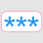
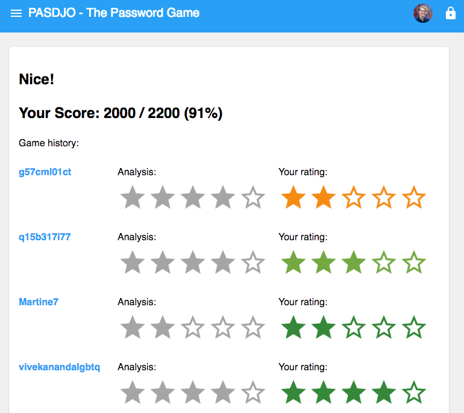

# PASDJO  # 
A game about password strength.

Currently deployed at https://password-game.firebaseapp.com 

## Game Mechanics

The player estimates the strength of a given password on a scale from 1 (weak) to 5 (strong). The game uses the zxcvbn password strength estimator to create an objective rating. If the player's rating matches the zxcvbn score, they will get 100 points. The higher the mismatch between the rating and the zxcvbn score, the fewer points the player will get. 

The goal of the game is get as many points as possible within one minute and as accurately as possible. 

## Scripts

Runnable from project root:
- `npm makecsv` generates nice CSV files to the `data` folder. `rounds.csv` contains each password, objective analyses and a user's perception. 

## Project Structure

### `/research` 

We log the responses to the database so we can analyze password strength perceptions. 

## Credits
- Polymer
- zxcvbn
- WebComponents.org

## License
to be added.